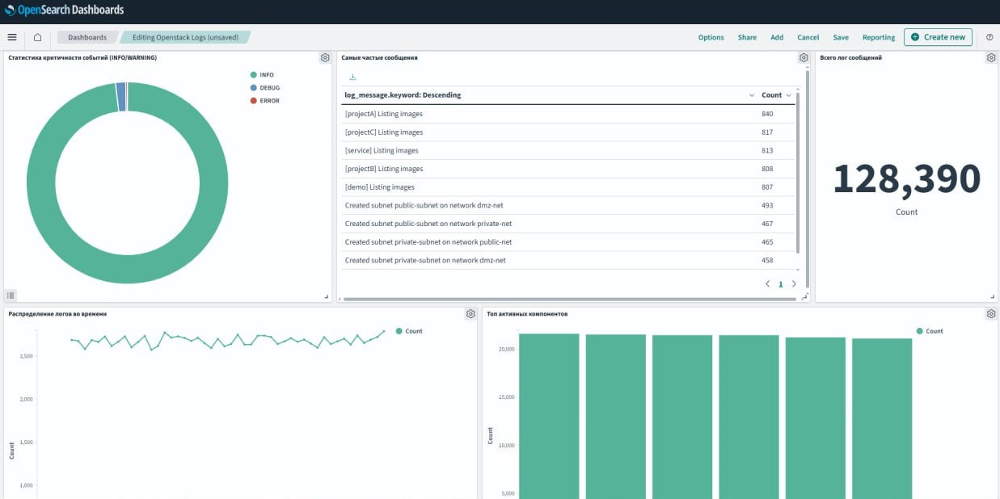

# OpenSearch Logs Dashboard

Веб-дашборд для поиска, анализа и визуализации логов из OpenSearch.

Проект предназначен для быстрого просмотра большого количества логов, фильтрации событий и анализа данных без необходимости работать непосредственно с OpenSearch API или консольными инструментами.

## Возможности

* подключение к OpenSearch;
* поиск и фильтрация логов;
* просмотр событий и их деталей;
* работа с временными диапазонами;
* агрегация и визуализация данных;
* удобный dashboard для оперативного анализа логов.

Проект демонстрирует опыт разработки прикладного инструмента для работы с:

* OpenSearch;
* большими объёмами логов;
* поиском и фильтрацией данных;
* агрегациями;
* визуализацией;
* web-интерфейсами для инженерных задач.

Вместо набора разрозненных запросов к OpenSearch пользователь получает единый интерфейс для поиска, анализа и визуализации логов.

Проект ориентирован прежде всего на практическое использование в задачах дебаггинга и мониторинга больших объемов логов.

---

## Автор

**duvean**

[GitHub](https://github.com/duvean)
